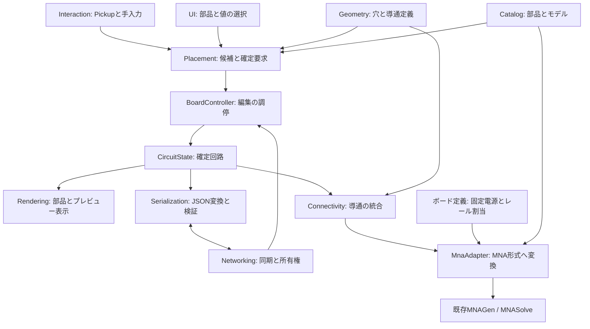

# モジュール設計

ここでのモジュール名・配置先は実装時の設計案。今回追加するのは資料のみで、空のUdonSharpスクリプトや未接続のPrefabは作らない。

## 1. 分割と依存関係



## 2. 各モジュールの責務

| モジュール / 配置案 | 所有するデータ・責務 | 入出力と境界 |
| --- | --- | --- |
| Geometry / `Runtime/Geometry` | `BoardLayout`。穴ID→位置、固定順位、内部導通グループ。ボード表面と操作領域。固定電源のレール/GND割当は同じボード定義の固定データに含める。 | 穴検索・ID照合を提供。Transformは座標変換用で、回路データには入れない。ネットワークやソルバーの計算処理を知らない。 |
| Catalog / `Runtime/Catalog` | 配置部品種別、フットプリント、端子順、表示用Prefab ID、値範囲。モデルIDと版、現行MNAへの変換に必要な情報。 | PlacementとMnaAdapterが同じカタログを参照。将来のモデル入力拡張を、配置データ形式から分離する。電源は配置部品カタログに含めない。 |
| Interaction / `Runtime/Interaction` | `BoardInput`。Pickup保持者・左右の手・押下エッジ・入力中断。 | 手位置/入力イベントを出す。穴の導通やJSONは扱わない。将来のDesktop入力もここに追加する。 |
| Placement / `Runtime/Placement` | `PlacementResolver`。候補穴・方向・全ピン位置・数値的な占有判定。 | `PlacementCandidate` と追加/削除/変更要求を出す。確定状態へ直接書き込まない。 |
| UI / `Runtime/UI` | `BoardPalette`。選択中の種別・値・モデル・長さ・方向・モード。表示上のエラー。 | 選択内容はローカル。確定するパラメーターだけを編集要求へコピーする。入力を消費したことをInteractionへ通知する。 |
| Controller / `Runtime/Core` | `BoardController`。各モジュールの初期化、編集権確認、変更の検証と一括確定、更新通知。 | ローカル編集と受信適用を区別する。配置表示と回路入力の更新を調停し、MNAの計算可否・履歴・波形を制御しない。 |
| State / `Runtime/Core` | `CircuitState`。最新の正常な回路ドキュメント、revision、次の部品ID。ピン占有索引は派生キャッシュ。 | 正本の唯一の更新窓口。候補状態を検証して一括置換する。GameObject参照を保持しない。 |
| Serialization / `Runtime/Serialization` | `CircuitJsonCodec`。VRCJsonによる書出し、型/版/値/参照の検証、数値正規化。 | JSON↔検証済み回路。ネットワーク送受信を知らず、将来の保存・読込にも使える。 |
| Networking / `Runtime/Networking` | `CircuitSync`。Manual同期文字列、送信中revision、再送、所有権の引継ぎ。 | 受信した候補をControllerへ渡す。RendererやMNAGenを直接操作しない。 |
| Rendering / `Runtime/Rendering` | `BoardRenderer` / `PreviewRenderer`。部品ID→ローカル表示オブジェクトの対応、Prefabの動的生成・破棄、半透明表示。 | 確定状態・候補からTransformを計算する。Rendererの位置から回路情報を逆算しない。 |
| Connectivity / `Runtime/Circuit` | `ConnectivityBuilder`。内部導通とワイヤーを統合し、穴ID→ノードIDを生成。 | 入力はBoardLayoutと確定部品列。表示、入力、ネットワークに依存しない。削除時も元データから再構築する。 |
| MnaAdapter / `Runtime/Simulation` | `BreadboardMnaAdapter`。配置素子とボード定義の固定電源をMNA形式へ変換。モデル参照の解決は差し替え可能な変換処理に集める。 | 新しいDataListを完成させてからMNAGenへ渡す。固定電源を重複追加しない。回路の可解性判定・実行の保留・波形制御は行わない。 |

MNAの回路診断、履歴・波形、プローブ、計算設定は外部の既存機能として扱う。Breadboard側にProbe/SimulationPresenterを追加する計画は設けない。ボードから公開する穴→ノードの対応は回路変換用であり、MNAの波形行番号への変換までは担当しない。

UdonSharpで利用可能な具象Behaviour、配列、DataList/DataDictionaryで実現する。表のモジュール境界はC# interface、任意のジェネリッククラス、実行時のScriptableObject生成を前提にしない。編集用カタログはEditor側で作り、実行時に必要な配列/データへ変換できる構成にする。

## 3. 更新経路

### ローカル操作

1. Interactionが保持と手入力を取得し、UIの入力消費を判定する。
2. PlacementがBoardLayout・Catalog・Stateから候補を作り、PreviewRendererが描画する。
3. トリガー押下でControllerへ編集要求を渡す。要求は操作時の基準revisionと部品IDを持つ。
4. Controllerが権限・revision・配置・データ・送信サイズ・表示容量を再検証する。
5. Stateを一括更新し、revisionを1増やす。Renderer更新と導通再構築を行い、固定電源を含むMNA入力を渡す。
6. Codecが完全なJSONを生成し、CircuitSyncが送信待ちへ登録する。送信失敗でも正本を空にしない。

候補の可否とJSON化可能性は確定前に確認する。フレームをまたぐ処理がある場合は最後にも基準revisionを照合する。入力から確定までの一連の要求を、古い回路へ再利用しない。

### 受信

1. CircuitSyncが最新の文字列を受け取り、Codecが別領域へ解析する。
2. 全項目・カタログ参照・端子・占有・版を検証する。
3. revisionを照合し、重複/古い状態は再適用しない。同じrevisionで内容が異なる場合は不整合として扱う。
4. ControllerがStateを一括置換し、ローカル操作と同じ配置表示・接続・MNA入力更新へ流す。
5. 受信しただけでは送信要求を出さず、同期の循環を防ぐ。

プレビュー変更ではStateChangedを発火しない。配置表示だけの変更と回路入力の変更を区別する。同一revisionでMNAへの再入力を繰り返さない。検証は配置とデータ形式が対象であり、短絡・未接続・部品がない状態等を理由にMNAへの入力を止めない。

## 4. 本体Pickupと編集権

- ボード本体の移動は既存Pickup/VRCObjectSyncへ任せる。部品表示・UIは本体の子として追従し、部品単位の同期BehaviourやPickupは作らない。
- CircuitSyncは本体と同じ所有権の対象へ置く構成を第一案とする。本体Transform同期とManual回路同期の共存を実クライアントで検証する。必要なら専用子オブジェクトへ分け、両方の所有権が一致するまで編集を閉じる。
- 「持っている」と「回路を変更してよい」は別の状態。初期同期待ち、所有権移譲中、版不一致は保持できても編集できない。
- 正常な引継ぎでは、前所有者の最終スナップショットを基準として次のrevisionを発行する。固定時間の待機だけで最新状態を受け取ったと判断しない。
- 前所有者が突然退出した場合は最後に共有された有効状態から復旧する。初期化コードが空JSONで上書きしない。保持者がいなければ編集中の候補を消す。

同期の内部状態は `WaitingForState / ReadOnly / Editable / SendPending / SyncError` 等で区別する。UIには利用者が判断できる短い文言を出す。

## 5. 既存コードとの接続・変更点

| 現状 | 移行先 / 実装時の作業 |
| --- | --- |
| `Board.cs` の穴配列・`isPlaceable(Rect)` | GeometryとState/Placementへ分割。穴IDの存在確認と全ピン判定に置換。矩形だけでピンや導通を表さない。既存の方向定義はそのまま引き継がない。 |
| `ComponentManager.cs` の `getRect()` | CatalogのフットプリントとPlacementの数値判定に分ける。表示モデル生成はRenderingへ置く。 |
| `Test.restart()` | BreadboardMnaAdapterが配置素子と固定電源を合わせた `DataList` を生成し、`MNAGen.netlist` を差し替えて `UpdateMNA()` を呼ぶ。旧入力は比較用に残せるが、同じソルバーを同時に更新させない。 |
| `Test.Update()` | 観測・波形表示・計算設定はMNA側の既存機能として維持し、Breadboardモジュールへ分割・移植しない。 |
| `MNAGen` のQ固定定数 | 後続のMNA側のモデル入力拡張に任せる。Breadboard側はモデルIDと版を保持し、MnaAdapterの変換箇所を後から置き換えられるようにする。 |
| `MNAGen.preprocessedNetlist`、`MNASolve` 初期化 | Adapterの初回実行前に準備完了を確認する。UdonのStart実行順に依存せず、必要なDataListの初期化を明示する。 |
| `MNASolve.ChangeCircuit()` の履歴継承 | MNA側の責務として維持する。Breadboard側からリセットやバッファ操作を追加しない。 |

`MNAGen` / `MNASolve` を別フォルダーへ複製しない。新しいボード側の資源は本フォルダー配下に置く。後続のモデル入力拡張は `Assets/MNATools` 側の別作業とし、今回のBreadboard仕様では既存の計算・表示処理の変更を要求しない。

## 6. リソース配置案

```text
Assets/BreadBoard/
  README.md
  Docs/                     # 今回作成する要件と設計
  model/                    # 既存モデルを維持
  Runtime/
    Core/ Geometry/ Catalog/ Interaction/ Placement/
    UI/ Serialization/ Networking/ Rendering/ Circuit/ Simulation/
  Editor/                   # 穴定義・部品/モデルカタログの作成と検証
  Data/                     # ボード定義・カタログ・必要な固定データ
  Prefabs/                  # ボードUI、ローカル部品表示
  Materials/                # 確定表示・半透明プレビュー
  Shaders/                  # ボード専用の表示用シェーダーが必要な場合
  Tests/                    # 接続・変換・同期データの意味を検証するもの
```

Runtime以下の各名前は責務の単位。小さな補助処理まで別Behaviourにして毎フレーム通知を増やす必要はない。穴定義、JSON、導通生成、MNA変換は独立に確認できる境界を保つ。

## 7. 実装順序

1. 実モデルと一致するBoardLayoutと固定電源設定、部品/モデルCatalog、CircuitState、JSONの往復変換。
2. 内部導通とワイヤーの統合、削除による分離、固定電源を含むMNA入力への変換。既存の手入力で生成されるデータと比較。
3. Pickup連携、最寄り穴、半透明プレビュー、UI、配置/削除/値変更。
4. Manual同期、途中参加、編集権と送信待ちの引継ぎ。複数クライアント確認。
5. 既存Testの回路入力から切り替える。Qモデル拡張を後から接続できることを確認し、計算・波形関連の処理はMNA側に任せる。

各段階の完了判断は [受け入れ条件](Acceptance.md) を使う。
